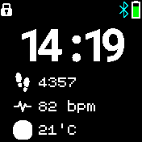
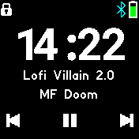

# Music Clock

More info on making Clock Faces: https://www.espruino.com/Bangle.js+Clock

A simple clock that diplays the local with 3 clock infos below.

If connected to gadgetbridge and music is detected, the clock will switch into music control mode displaying the track name, artist and buttons for play/pause, previous and next.

When in music mode, swiping left/right will go to the previous/next song, siwiping up/down will control the volume.

To change what is shown in the clock info:

- Unlock the watch
- Tap on the clock info you wish to change
- Swipe up/down to change clock info within the given group
- Swipe left/right to change the group (eg. between standard Bangle.js and Alarms/etc)

Data is provided by [Clock Info](http://www.espruino.com/Bangle.js+Clock+Info) so any apps that implement this feature can add extra information to be displayed.

## Creator

Sam ([samakj](https://github.com/samakj))
